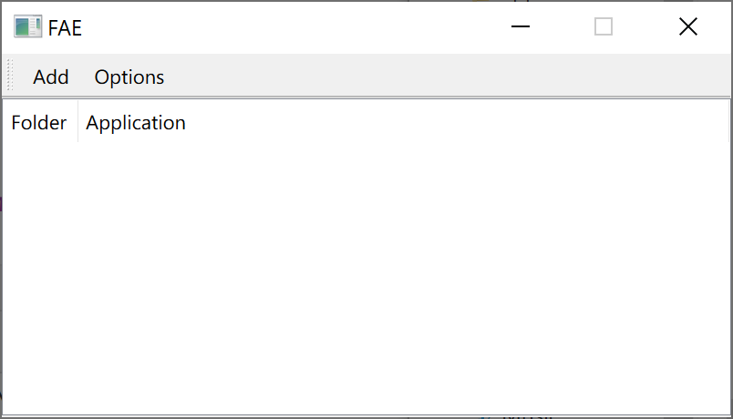

# FAE

File Association Enhancement.

I have three video players, `MPC-BE` for anime, `PotPlayer` and `mpv` for the others. 
However, in Windows, for specify video type such as `.mkv`, you can only associate it with **one** application.

FAE is working for this situation.

FAE will check the rules configured before opening a file.
The rule is something like `using this application to open videos under that folder`.

## Usage

FAE is under developing, so there isn't a release version, you need to build from source.

### 1. Create your own configuration file.

Make a copy of [fae.sample.json](fae.sample.json), rename to `fae.json`, change the config items:

```json
{
  "rules": [
    {
      "index": 1,
      "app": "app 1",
      "folder": "folder 1"
    },
    {
      "index": 2,
      "app": "app 2",
      "folder": "folder 2"
    }
  ],
  "fallback": "fallback",
  "aliases": {
    "potplayer": "path to potplayer.exe",
    "mpc-be": "patch to mpc-be.exe"
  }
}
```

### 2. Build an executable file

```shell
pip3 install -r requirements.txt
pyinstaller.exe --onedir --noconsole --noconfirm fae.py
pyinstaller.exe --onedir --noconsole --noconfirm judge.py
```

### 3. Configure

Execute configure.exe:



### 4. Configuration file

Move the new configuration file in step 1 into `%APPDATA%/fae`.

### 4. Open video files with judge.exe


## LICENSE

[MIT](LICENSE)
