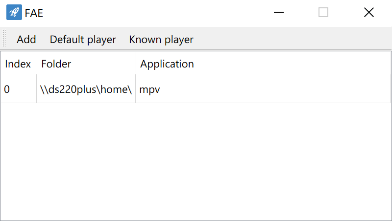
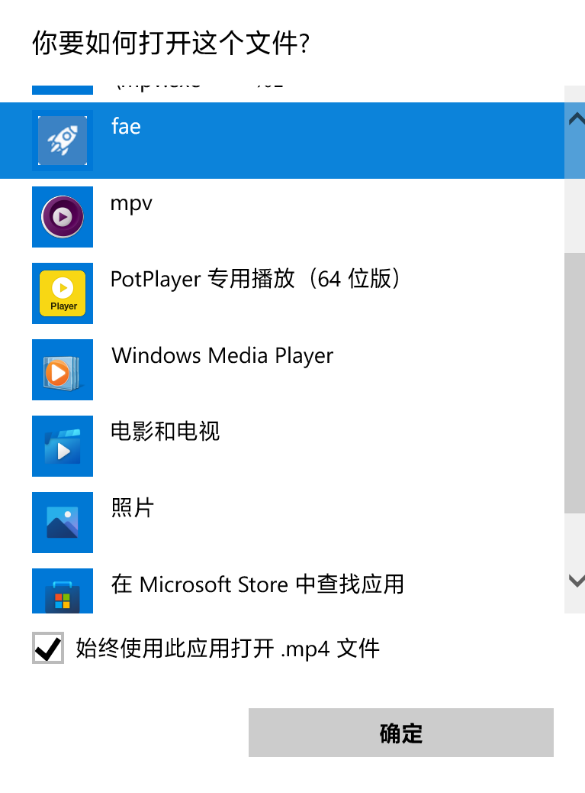

# FAE

File Association Enhancement.

A python application supports rule-check before opening videos. You can associate different players for different rule.

For example:

1. rule A -> folder `testA` -> opened by player `MPV`;
2. rule B -> folder `testB` -> opened by player `MPC-BE`;
3. rule C -> folder `testC` -> opened by player `PotPlayer`.

## Usage

1. Download the latest application
   on [https://github.com/akiakise/fae/releases](https://github.com/akiakise/fae/releases)

2. Doubleclick `fae.exe` and add your own rules:
   

3. Always open video files with fae.exe:
   

4. Doubleclick the file you want to open, then the rule will determine whether player to use.

## LICENSE

[MIT](LICENSE)
